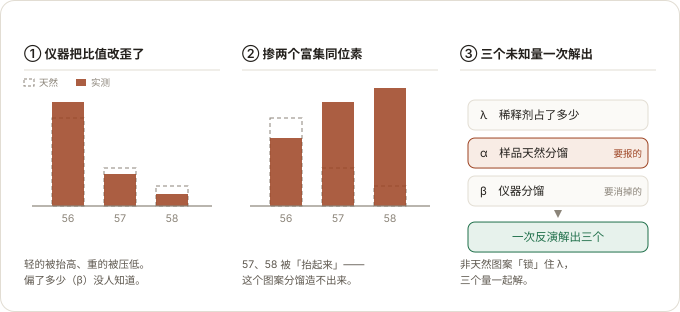

# The double spike toolbox

Error propagation and data reduction for the double spike technique in mass spectrometry.

The workings of this package are described in:

Rudge J.F., Reynolds B.C., Bourdon B. The double spike toolbox (2009) Chem. Geol. 265:420-431
https://dx.doi.org/10.1016/j.chemgeo.2009.05.010

and at:

https://johnrudge.com/doublespike

---

> ## Start here: the double spike primer
>
> ### Read it online: <https://chengkaide.github.io/pyspike/>
>
> 
>
> The figure above is generated from the landing page rather than drawn twice:
> `python tools/make_hero_svg.py` rebuilds it, and [`tools/check_readme.py`](tools/check_readme.py)
> fails if it ever drifts away from the page it came from.
>
> **New to the method, or new to this code? Read this first.** It is the complete introduction:
> why two spikes are needed at all, how an experiment is actually carried out step by step, where
> the three unknowns come from, and a ranked catalogue of the double spikes that make sense for
> **every one of the 33 isotope systems** in the data file -- both the idealised pure spikes (the
> theoretical limit) and the real Oak Ridge spikes you can buy, impurities and all.
>
> The primer is written in **Chinese**; this README and the code comments are in English.
>
> It is also a **single file, completely offline** document with every figure inlined:
> [`docs/double-spike-primer.html`](docs/double-spike-primer.html). Download it, open it in a
> browser, and it works with no network at all. (GitHub serves `.html` as source code, so prefer
> the online copy or a local one over the repository view.)
>
> It is written by a beginner, for beginners, with AI assistance, and says so on the first screen.
> Every number in it is regenerated from this package rather than typed in by hand, and
> [`tools/check_primer.py`](tools/check_primer.py) fails if the prose ever drifts away from what
> the code computes.

---

## Installation

This is a standard python 3 package, which can be installed using pip:

```
pip install doublespike
```

## Usage

A series of Jupyter python notebooks describing usage can be found in the [src/](src/) folder. New
users should begin by looking at [src/example.ipynb](src/example.ipynb)

## Web GUI

[`webgui/doublespike-gui.html`](webgui/doublespike-gui.html) is a single file, completely offline
browser interface to the same calculations: pick an element, build a double spike, see the error
curves and the 2D precision map, rank every possible double spike, and reduce measured beam
intensities. Just open it in a browser -- no installation, no network access, no data leaves the
machine. See [webgui/README.md](webgui/README.md) for how it is built and how it is verified
against this Python package.

## Rebuilding the primer

The **double spike primer** linked at the top of this file is generated, not written by hand, so it
can be regenerated at any time:

```bash
python tools/dspike_catalog.py   # compute the catalogue (a few minutes, uses all cores)
python tools/build_primer.py     # assemble the document
python tools/check_primer.py     # verify prose, tables and figures against the code
```

`tools/dspike_catalog.py` writes [`docs/dspike_catalog.json`](docs/dspike_catalog.json), which
`tools/build_primer.py` inlines into [`docs/primer_template.html`](docs/primer_template.html) to
produce the final document. `tools/check_primer.py` is the gate: it re-derives every number quoted
in the prose and every table cell from this package, and exits non-zero if any of them disagree.
Adding a sentence or a figure therefore means updating the template and the checker together.

GitHub Pages serves the `docs/` folder, so <https://chengkaide.github.io/pyspike/> is the landing
page. [`docs/index.html`](docs/index.html) is that landing page and is **hand written** -- it is the
one file in `docs/` that is not generated, and it links to the primer by its filename, so renaming
the document means editing it too. `tools/check_readme.py` checks its links as well.

## What is in the box

| function | purpose |
|---|---|
| `IsoData` | isotope system data (masses, standard composition, available single spikes) |
| `dsinversion` | reduce a measured mixture to (alpha, beta, spike proportion) |
| `errorestimate` | linear error propagation: the precision of alpha, or of a chosen ratio |
| `errorestimate_many` | vectorised `errorestimate` over arrays of proportions and spikes |
| `optimalspike` | search every double spike composition for the best precision |
| `errorcurve`, `errorcurve2`, `errorcurve2d`, `errorcurveoptimalspike` | the standard plots |
| `monterun` | Monte Carlo simulation of a mass spectrometer run |
| `spike_calibration` | calibrate a double spike from spike-standard mixtures |
| `sensitivity` | derivatives for sensitivity analysis (appendix B of the paper) |

## Testing

```bash
pytest                        # if pytest is installed
python src/test/run_tests.py  # otherwise: a dependency free mini runner
```

Beyond the unit tests there are several verification scripts, all of which can be re-run:

```bash
PYTHONPATH=src python tools/verify.py                  # forward/inverse closure + stress + Monte Carlo
PYTHONPATH=src python tools/benchmark.py               # timings
PYTHONPATH=src python tools/check_against_literature.py # reproduce published optimum spikes
PYTHONPATH=src python tools/check_primer.py            # the primer vs this package
python tools/check_readme.py                           # links, code fences and layout of this file
node webgui/test_math.js                               # the browser code vs this package
```

`tools/verify.py` checks that the forward model survives a round trip through the inversion for
every isotope system, that it still does so under extreme fractionations (where the original
solver failed on about 6% of cases), and that the linear error propagation agrees with Monte
Carlo.  `webgui/test_math.js` compares the JavaScript port against reference values computed by
this package: 437 comparisons, all agreeing to better than 1e-12 relative.
`tools/check_against_literature.py` recomputes optima that papers have published to four
significant figures; the Fe results come back digit for digit.
`tools/check_primer.py` is the honesty check on the write-up itself: it re-derives the numbers
quoted in `docs/double-spike-primer.html` and exits non-zero if any of them disagree.
`tools/check_readme.py` covers this file: it resolves every relative link against the repository,
checks that the code fences balance, and asserts that the primer is still the first thing a reader
sees. It takes an optional path, so it can be pointed at a deliberately broken copy to confirm it
still fails when it should.

## Changes in 1.1

The numerics are unchanged in intent but the implementation is substantially faster and more
robust.  Every change is cross checked against 1.0 by re-running the old and new code side by side
on the same inputs.

### Inversion: a different iteration model

The double spike equations are **linear in lambda**, so lambda can be eliminated analytically.
Requiring the value of lambda implied by two different ratios to agree leaves a 2 x 2 system in
(alpha, beta), solved by a damped Newton iteration with an analytic Jacobian, a direction
preserving step limit and a backtracking line search on the residual. This replaces
`scipy.optimize.fsolve` and removes the ill conditioned `1/(1 - lambda)` reparameterisation.

| | 1.0 (`fsolve`) | 1.1 (lambda eliminated Newton) |
|---|---|---|
| one inversion | 214 us | **11 us** (vectorised, ~20x faster) |
| 20 000 inversions | ~4.3 s | **0.22 s** |
| iterations | variable, can hit `maxfev` | mean 2.6, max 3 |
| extreme conditions (beta in +-12, alpha in +-1) | 207 failures in 3432 (6.0%) | **0 failures in 24 000** |
| forward model recovered to | -- | 1.5e-11 |

`dsinversion` now processes a whole matrix of measurements in one vectorised call and reports
`converged` and `residual` per measurement.

### Vectorised error propagation

`errorestimate` accepts arrays of spike-sample proportions and spike compositions, so a 2D error
map is one call instead of `resolution**2` python level calls.

| | 1.0 | 1.1 |
|---|---|---|
| `errorcurve2d` at resolution 100 (10 000 points) | 12.2 s | **0.53 s** (23x faster) |
| 20 000 proportions | 25.8 s | **0.72 s** (36x faster) |
| 12 x 9 grid, python loop vs one call | 111 ms | **5.6 ms** |

A single scalar `errorestimate` call is the same speed as before (1.3 ms); that call is dominated
by numpy's per-call overhead, so the win only appears once you evaluate many points at once, which
is what the plots and the optimiser do.

### Optimal spike search

`optimalspike` evaluates a coarse grid in one batched call, then runs an adaptive per-axis pattern
search and a quadratic surface fit.  The two step sizes adapt independently because the error
surface is a narrow curved valley.  Same answers as before for the combinations that matter, and no
longer prints a traceback for the combinations that fail.

| | 1.0 | 1.1 |
|---|---|---|
| one (spike, mixing ratio) optimum | 0.23 s | **0.13 s** |
| every `real` spike pair for Ca (225 combinations) | 51 s | **31 s** |

`optimalspike` is a local search.  On the best ranked double spikes the two implementations agree to
machine precision; on the worst ranked combinations (tens of times less precise) they can differ by
up to ~1%, because they settle in different local minima of a nearly flat surface.

### Bugs fixed

* `plotting.errorcurve` passed a second positional argument to `set_title`, which mpl interprets as
  `fontdict`; the "error on a ratio" title was therefore broken.
* `changedenomcov` in the vectorised error propagation initially wrote into a temporary copy
  (`a[:, i, :][:, :, j] = ...`) and silently returned zeros.
* `normalise_composition` relied on `type(x) is float`, which is false for numpy scalars.
* `monte.monterun` used `isinstance(x, float)`, so numpy scalars, ints and 0-d arrays were handled
  inconsistently, and it was impossible to make a run reproducible. It now takes `seed=`.
* `monterun` returned a tuple containing `None` when only the spike had an error model.
* `pkg_resources` (deprecated by setuptools) replaced with `importlib.resources`.
* `IsoData.isoinv` shared its array with `IsoData.isonum`.
* `isoindex` used `np.vectorize`, which cost more than the entire error calculation; it is now a
  cached dictionary lookup.
* `optimalspike` printed a traceback for every combination that failed instead of ranking it last.

### Packaging

* `setup.cfg` folded into a modern PEP 621 `pyproject.toml`; `setup.cfg` removed.
* Python floor raised to 3.9, numpy floor to 1.20.
* CI updated to Python 3.9-3.13 and current action versions.
* `src/test/run_tests.py` runs the whole suite without pytest.
